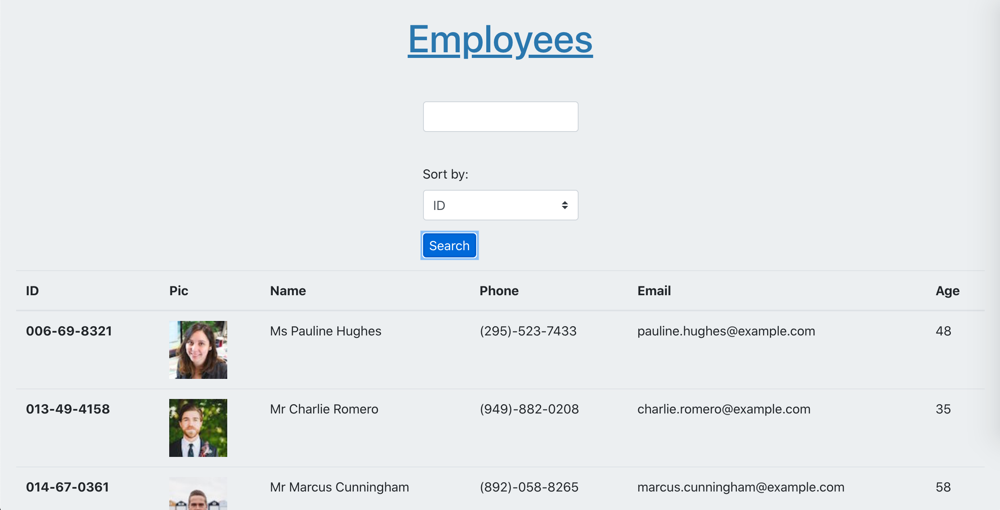

# React Employee Directory

## Table of Contents
1. [Description](#description)
2. [Installation](#installation)
3. [Technologies](#technologies)
4. [Usage](#usage)
5. [Contributing](#contributing)
6. [Tests](#tests)
7. [Questions](#questions)
8. [License](#license)
## Description
An employee directory, using fake employee data from RandomAPI, built for organizing employee data. Created with Axios, React, Node, and Bootstrap for the University of Washington's 2020/21 Coding Bootcamp."

## Installation
Clone the git into your chosen directory, use npm i to install all dependencies, and run the application using npm start.

## Technologies

## Usage
The users will be generated in a table below, with 200 total. Typing in the input field below the title will include any fields that contain that exact word or phrase. The select menu will sort by that field, ascending. Press the submit button to filter and/or sort.

[Live site demo](https://tmk-employee-directory.herokuapp.com/)

## Contributing
Fork this repository on Github. Email timothy.m.keller@gmail.com about pull requests.

## Tests
No testing suite is currently designated.

## Questions
Written by [tmkeller](https://github.com/tmkeller) on Github.
Email the author at timothy.m.keller@gmail.com.

## License
[CC0](http://creativecommons.org/publicdomain/zero/1.0/)